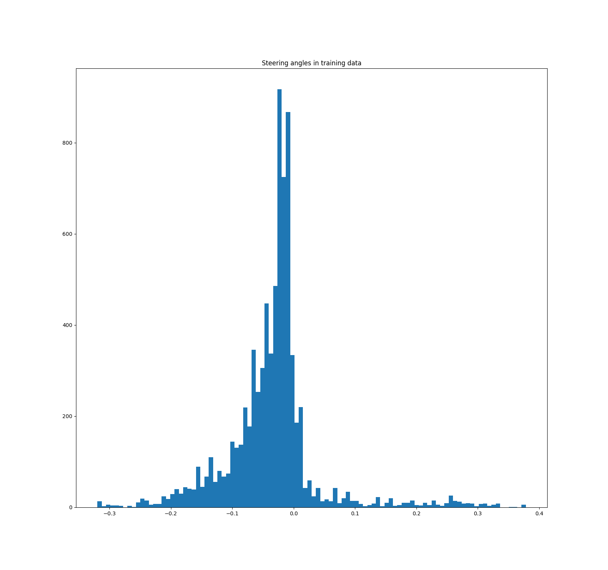
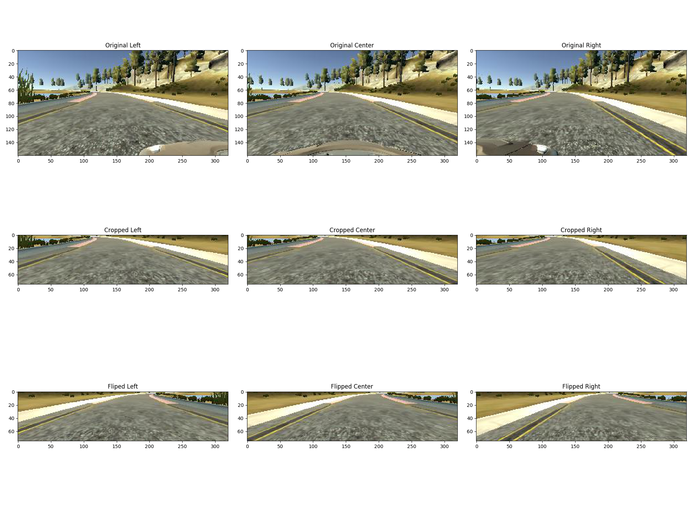
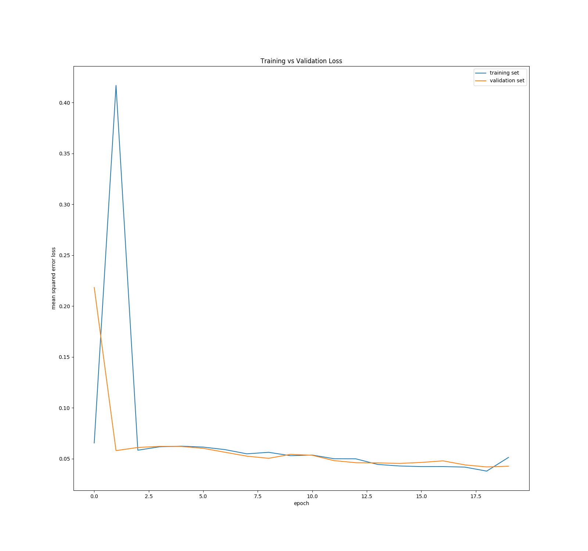
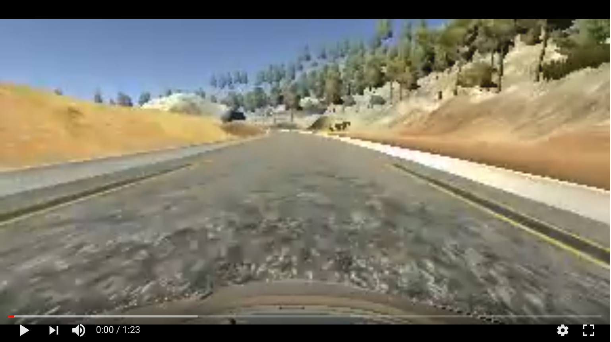
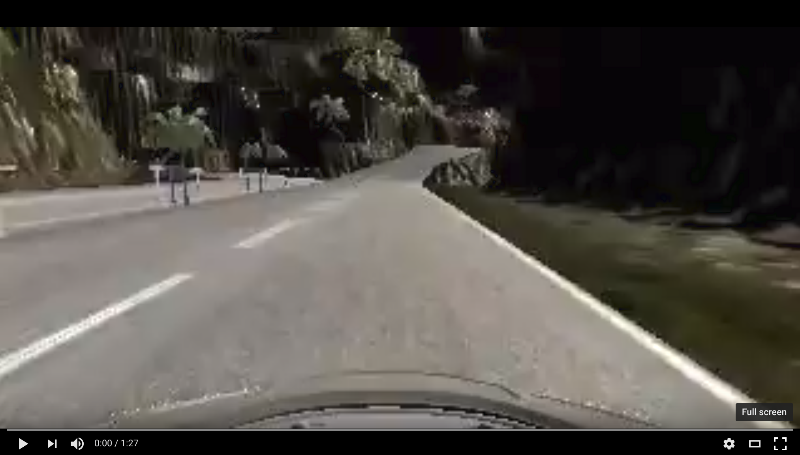

# **Behavioral Cloning**

## Project Writeup

__Author__: Ciaran Murphy

__Date__: 27th Oct 2017

The objective of this project is was to drive a car around a track inside the
Udacity driving simulator to generate training data and to then use that data
to trail a self-made neural network. The model would then be capable of driving
the same car around the track autonomously. As an additional (optional)
objective a second, more complex track was available to try out as well. 

In the following sections I will cover each bullet in the rubic one by one.

## Required Files

### Are all required files submitted?
----------------------------------------

The following files are supplied in the git repo:

- __model.py__

  This file contains the code to implement the model and to load + train the
  data. It is the file that contains the implementation of the solution to the
  project.

- __drive.py__

  This file is a script that was supplied in the coursework to be used to run
  the model and cause the car to complete a lap of the track autonomously. No
  changes were made to this file in my implementation of the project.

- __model.h5__

  This file is the output of `model.save()` in Keras. It is the stored model
  after training.

- __video_a.mp4__

  This is a video of the final results - a full lap of the track in autonomous
  mode.


## Quality of Code


### Is the Code Functional?
------------------------------

The model.py file was developed for Python v3 with Keras v1.2.1. It was trained
on an AWS instance with Nvidia GPU. For command line args, see the help output
below.

```shell
$ python ../model.py -h
Using TensorFlow backend.
usage: model.py [-h] [-t]

optional arguments:
  -h, --help   show this help message and exit
  -t, --train  Enable to run training. If not set, assume data analytics only.
               If running only analytics, there must be a pickle file in the
               local dir called ./output/model_training_hist.pkle that
               contains the training history data from a previous training
               run.
$ 
```

### Is the code usable and readable?
-------------------------------------

To train the model, issue the following command:

```shell
$ python model.py -t

```

The model.py script uses a generator to feed the data to the `mode.fit()`
function. This became necessary as the size of the data increased. Not using
a python generator would have meant loading the training data into memory which
was leading to out-of-memory crashes.

The code is structured around a `main()` method which acts as the entry point
to the implementation. See the descriptions and comments in the code for
additional information.


## Model Architecture and Training Strategy


### Has an appropriate model architecture been employed?
-----------------------------------------------------------

The final model design was based on the [Nvidia CNN
architecture](https://devblogs.nvidia.com/parallelforall/deep-learning-self-driving-cars/), 
but with dropout and an additional convolution. For full details see the section
below on _Architecture and Training_.  


### Has an attempt been made to prevent overfitting?
-------------------------------------------------------

To reduce overfitting, a small number of epochs are chosen and a dropout layer
is added between the 1st and 2nd convolution layers.

### Have model parameters been chosen appropriately?
-------------------------------------------------------

The model uses the Adam optimizer, which is the "Adaptive Moment Estimation"
optimizer. It is an adaptive learning rate algorithm that tracks an
exponentially decaying average of past gradients (momentum) as well as an
exponentially decaying average of past _squared_ gradients (like RMSProp).
Since it's an adaptive optimizer, the default hyperparameters are generally ok
and don't need to be modified: just pass it to the Keras/TensorFlow
`model.fit()` API and we to not need to worry too much about searching for the
optimal hyperparater values.


### Has the training data been chosen appropriately?
-------------------------------------------------------

The training data was generated by driving around the track 5 or 6 times while
trying as hard as possible to stay in the exact middle of the track. After the
first attempt at training the model, it was clear that there were two areas
that were causing significant problems: the first left turn after the bridge,
and the relatively straight section immediately after the right turn just past
the left turn mentioned above. To understand more about the approaches taken to
resolve these issues, see the section below on _training dataset and training
process_.


#### Raw data observations

The summary from Pandas on the raw input data for track A is as follows:

```shell
Summary of data:
          steering     throttle   break        speed
count  7824.000000  7824.000000  7824.0  7824.000000
mean     -0.034995     0.395828     0.0    29.796577
std       0.076133     0.057079     0.0     1.880381
min      -0.319648     0.000000     0.0    10.038280
25%      -0.064516     0.400000     0.0    30.038030
50%      -0.029326     0.400000     0.0    30.038310
75%      -0.011730     0.400000     0.0    30.038370
max       0.378299     1.000000     0.0    30.613680
```

In this project we don't use the last 3 columns, but a few observations are
possible with respect to the steering angles:

-  They are normalized in the range -1 to +1
-  Most are less than zero, meaning the data is biased to left turns. This is
   expected given that the track runs anticlockwise.
-  The steering data is quite clustered around zero
 
When visualized in a histogram, these observations become clearer:



This clustering of steering data could be overcome by generating more training
data while driving the wrong way around the track for example. It's an
important factor to consider as this bias might lead to problems with e.g.
slight right turns or right leaning stretches of track. However I found that by
being careful about the generation of clean training data, I was able to avoid
having to compensate for this left bias, as we will see later.


## Architecture and Training Documentation

### Is the solution design documented?

The model chosen was based on the [Nvidia CNN
architecture](https://devblogs.nvidia.com/parallelforall/deep-learning-self-driving-cars/)
but with a dropout layer directly after the first convolution and 5 convolutions
instead of 4. The model rapidly shrinks the surface area of the data and
elongates it into a large number of filters. This enables the model to recognize
shapes and patterns with varying complexities (low complexity in the initial
layers, high complexity in the final layers), located anywhere in the images.

For increased efficiency, I decided to include the image normalization and image
cropping steps inside the model itself, rather than outside in a separate
preprocessing step. More on preprocessing and augmentation later.

At the end of the convolution layers, the data is flattened and then passed
through a sequence of 4 fully-connected layers. The final output is a single
value which represents the recommended steering angle to send to the simulator. 


### Is the model architecture documented?
------------------------------------------

The complete model architecture is summarized in the following table:

```shell
____________________________________________________________________________________________________
Layer (type)                     Output Shape          Param #     Connected to                     
====================================================================================================
normalize (Lambda)               (None, 160, 320, 3)   0           lambda_input_1[0][0]             
____________________________________________________________________________________________________
crop (Cropping2D)                (None, 75, 320, 3)    0           normalize[0][0]                  
____________________________________________________________________________________________________
convolution2d_1 (Convolution2D)  (None, 36, 158, 24)   1824        crop[0][0]                       
____________________________________________________________________________________________________
dropout_1 (Dropout)              (None, 36, 158, 24)   0           convolution2d_1[0][0]            
____________________________________________________________________________________________________
convolution2d_2 (Convolution2D)  (None, 16, 77, 36)    21636       dropout_1[0][0]                  
____________________________________________________________________________________________________
convolution2d_3 (Convolution2D)  (None, 6, 37, 48)     43248       convolution2d_2[0][0]            
____________________________________________________________________________________________________
convolution2d_4 (Convolution2D)  (None, 4, 35, 64)     27712       convolution2d_3[0][0]            
____________________________________________________________________________________________________
convolution2d_5 (Convolution2D)  (None, 2, 33, 64)     36928       convolution2d_4[0][0]            
____________________________________________________________________________________________________
flatten_1 (Flatten)              (None, 4224)          0           convolution2d_5[0][0]            
____________________________________________________________________________________________________
dense_1 (Dense)                  (None, 100)           422500      flatten_1[0][0]                  
____________________________________________________________________________________________________
dense_2 (Dense)                  (None, 50)            5050        dense_1[0][0]                    
____________________________________________________________________________________________________
dense_3 (Dense)                  (None, 10)            510         dense_2[0][0]                    
____________________________________________________________________________________________________
dense_4 (Dense)                  (None, 1)             11          dense_3[0][0]                    
====================================================================================================
Total params: 559,419
Trainable params: 559,419
Non-trainable params: 0
____________________________________________________________________________________________________

```

### Is the creation of the training dataset and training process documented?
----------------------------------------------------------------------------

#### Image processing and augmentation

To maximize the ability of the model to perform, the images were treated by
cropping them to contain only the horizontal section showing the road (removing
the sky and hood of the car). In addition to this step, the left and right
images were added to the training data and given a fixed steering angle
prediction. This has the effect of instructing the model "if you see an image
that looks like we are leaning to the left, tilt the car to the right, and
vice-versa". To further enhance the data, all images were copied and flipped
using `cv2.flip()` with steering angles added according to the same approach as
the original images. See below for a random example of the 3 stages - original,
cropping and flipping.



#### More on generating training data

As mentioned previously, there were two areas that were causing significant
problems: the first left turn after the bridge (approx time 33s in the video),
and the relatively straight section immediately after the right turn,
immediately past that left turn just mentioned (approx time 43s in the video). 

The first problematic area (i.e. left turn) is unique in that the right hand
side of the track at this point has an unusual border unlike most (or all) of
the other bends. The model was having a difficult time recognising this
particular section as a sharp left turn and was driving into the square block
just after the apex of the bend, or driving off the road altogether. 

The second problematic area was much less obvious. It is difficult to see, but
this particular section of track seems to angle very slightly to the right. The
rest of the track is heavily bias to the left (it's an anticlockwise circuit),
which might explain the uniqueness of this section and therefore the difficulty
the model had in learning how to handle it.

To tackle these challenges I first tweaked the model extensively, adding layers
and preprocessing, augmenting the data, trying different numbers of epochs,
etc.  At some point, I got to the stage where I couldn't achieve any meaningful
improvements by tweaking the image preprocessing, or by making various model
enhancements, or by adding more and more training data for the problematic
sections, or by tweaking hyperparameters. So instead, I decided to generate
completely new training data in the hope that my new knowledge of what the
model would struggle with would enable me to generate more helpful training
data. While generating the new data, I paid specific attention to keeping the
steering angle positive (i.e. pointing to the right) for the problematic
straight section and for the problematic left turn I tried to exaggerate the
desired behavior as much as possible. I also paused the recording in these two
sections, reversed and recorded it again around 5 to 6 times each. That meant
there was clean data for the full track and even more clean data with desirable
data for the two problematic areas. This combination of steps resolved the
issues.


#### The training step

After going through the process described above, the final training vs.
validation loss looked as follows:



As can be seen in the graph, the model trains quite rapidly and settles at an
accuracy rate of about 0.05 after 20 epochs. My experience was that training beyond this value
actually produced worse results when the model was subsequently fed through the
simulator in autonomous mode (i.e. produced overfitting effects). 

## Simulation

### Is the car able to navigate correctly on test data?

Below is a video of the car driving around the first track autonomously
<<<<<<< dc95338ef6d659bad7b4b3fdd5ad8194e2e9ee2d
under the instruction of the fully trained model (note - redirects to YouTube).
=======
under the instruction of the fully trained model *(note - redirects to YouTube)*.
>>>>>>> Final writeup before 1st submission

[](https://youtu.be/ld_03QTCGHU)


## Additional Suggestions -- Track Two

<<<<<<< dc95338ef6d659bad7b4b3fdd5ad8194e2e9ee2d
The model that I trained for track one worked amazingly well on track 2, with no
modifications at all. The second track is a lot more complex as there are
many more corners, they are sharper, the edges of the road look different,
there are hills, etc. It was very encouraging therefore, to see that the model
worked on all but one or two of the sections on the second track. Note that in
the file drive.py, the speed is hard coded to 9mph in autonomous mode, which
helps a lot on the hills in tracks 2.

A simple approach would be to generate training data for the second track,
simply add it to the training data for the first track, and retrain the
original model. Interestingly when I tried this approach, despite trying
various modifications to the hyperparameters, I found I was getting worse
results than before! I therefore removed all the training data for the second
track, **except** the images for the sections where the model was having
difficulty. 

A better way to enhance the model would be to save the features of the trained
model from the first track, pass in new training data for the second track,
then add a new dense block of layers to produce a final steering predictions. 
In addition to this (or instead of), fine tuning could be used on one or more
of the Conv layers from the original model to enhance the model for additional
images from the second track. Unfortunately due to time constraints I was
unable to complete this experiment.

Nevertheless, below is a link to a video of how the model performed on track
two. It's not visible in the video, but there was one or two sections where
I had to manually intervene to keep the car on the track (note - redirects to YouTube).
=======
The model that I trained for track one worked amazingly well on track two, with
no modifications at all. The second track is a lot more complex as there are
many more corners, they are sharper, the edges of the road look different,
there are hills, etc. It was therefore very encouraging to see that the model
worked on all but one or two of the sections on the second track. One thing
that helped is that in the file drive.py, the speed is hard coded to 9mph in
autonomous mode.

A simple approach would be to generate training data for the second track,
add it to the training data for the first track, and retrain the
original model. Interestingly when I tried this approach, I found I was getting worse
results than before! I tried removing all the training data for the second
track, **except** the images for the sections where the model was having
difficulty, but this didn't really help at all. 

A better way to enhance the model would be to save the features of the trained
model from the first track, pass in new training data for the second track,
then add a new dense block of layers to produce a final steering predictions.
In addition to this, fine tuning could be used on one or more of the Conv
layers from the original model to enhance the model for additional images from
the second track. Unfortunately due to time constraints I was unable to
complete this experiment.

Nevertheless, below is a link to a video of how the model performed on track
two. It's not visible in the video, but there was one or two sections where
I had to manually intervene to keep the car on the track *(note - redirects to YouTube)*.
>>>>>>> Final writeup before 1st submission

[](https://youtu.be/N8iegtEgEZk)


